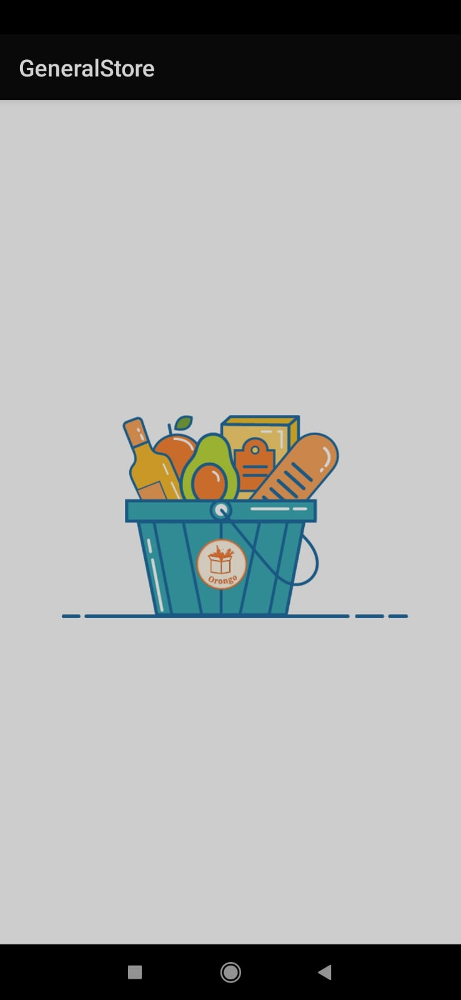
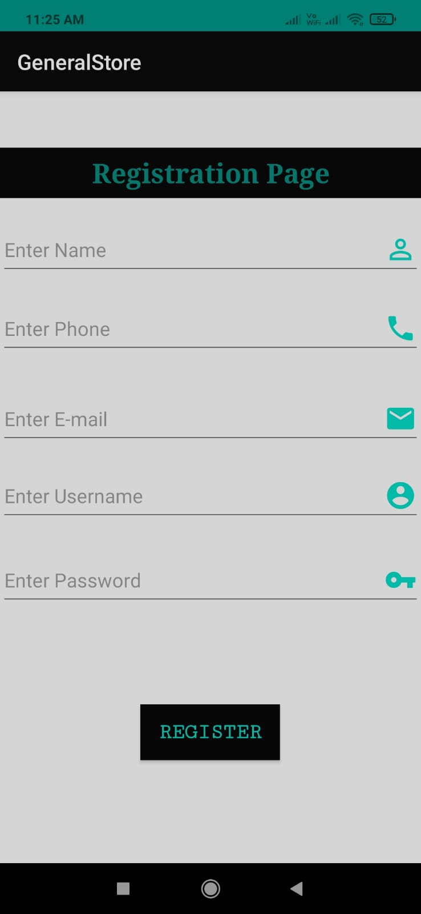
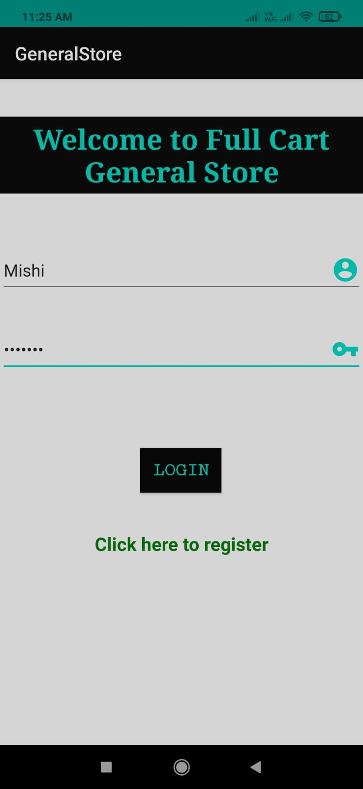
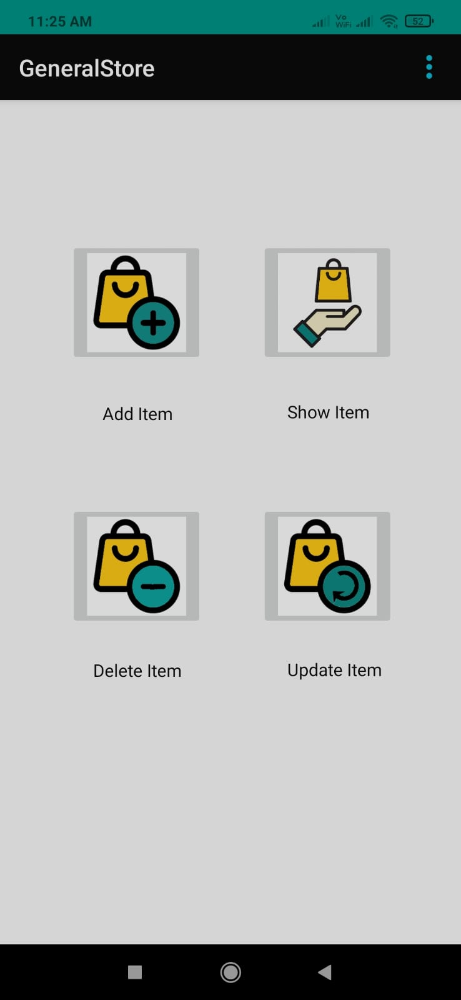
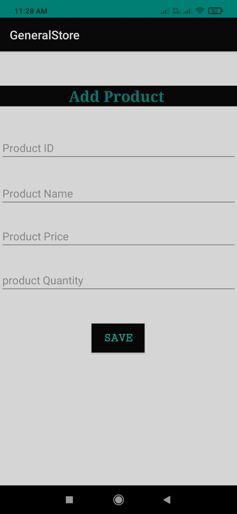
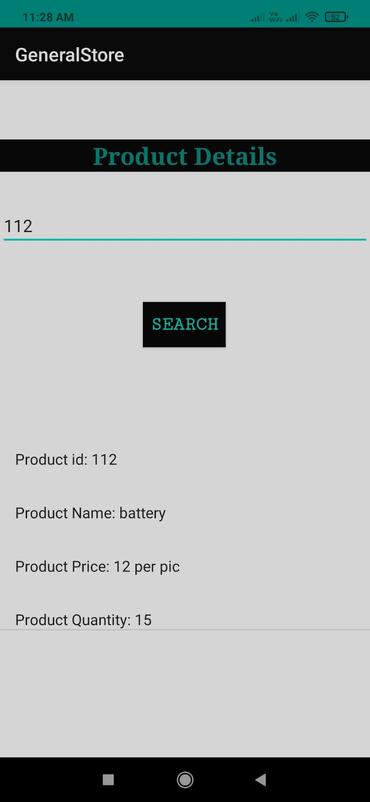
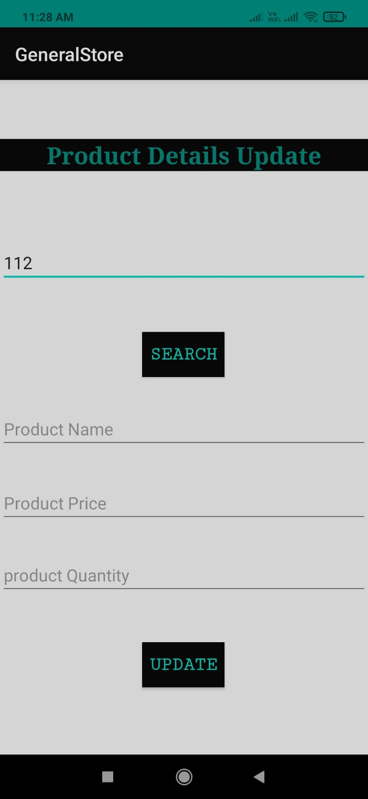
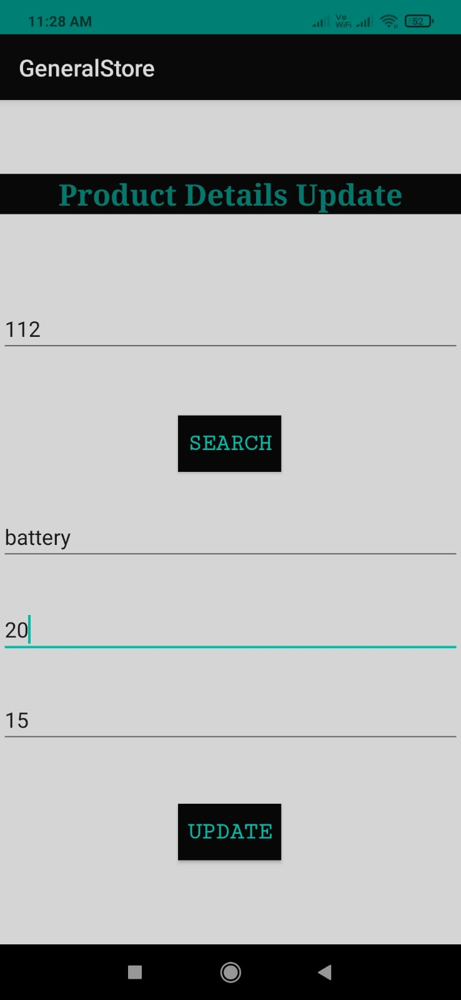
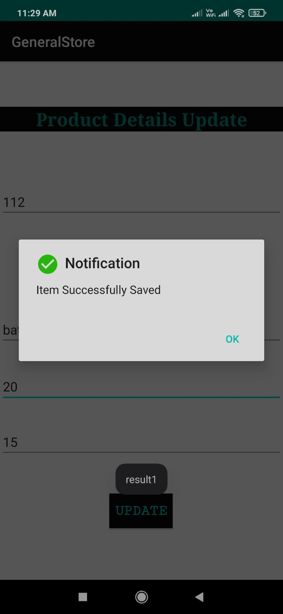
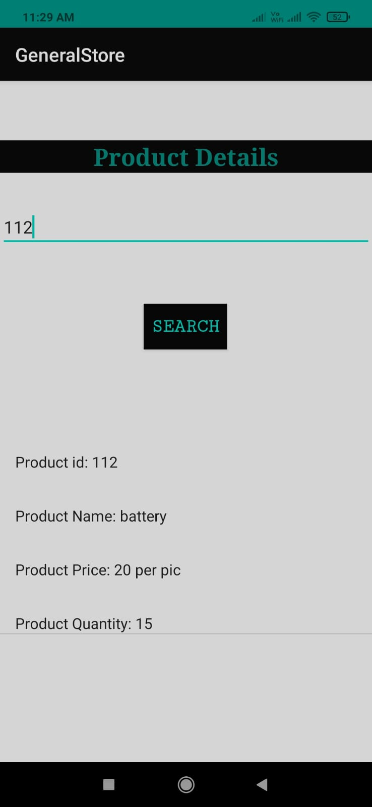

# Mini General Store - Full Cart Store 🛒

## About the Project

`General store - Full Cart Store` is a mini `android application` build for the shopkeepers to maintain records of products in users' small general store shop. It uses `SQLite database` to store data locally on the user's device.

## Target

It aims to replace the tedious task of maintaining traditional pen-paper record by an Android application.

## Screenshots of the application

### Register/Login and Dashboad

<table>
        <tr> 
        <td></td>
        <td></td>
        <td></td>
        <td></td>
        </tr>
</table>

### Add items and Show item details

<table>
        <tr> 
        <td></td>
        <td></td>
        </tr>
</table>

### Update item details and Show updated item details

<table>
        <tr> 
        <td></td>
        <td></td>
        <td></td>
        <td></td>
        </tr>
</table>

## Technology

- JAVA for back-end
- XML for front-end
- SQLite for database

## Tools

- Android Studio
- Git
- GitHub

## Setting up project

1. Fork this project by clicking the Fork button on top right corner of this page.

2. Clone the repository by running following command in git:

   `$ git clone https://github.com/[YOUR-USERNAME]/Mini-General-Store.git`

